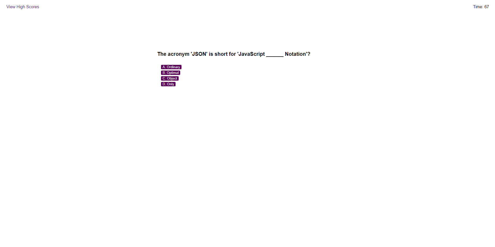

# Web_API_Challenge_Module_4

## Description

-This project created an interactive, timed quiz covering JavaScript fundamentals.

-Upon launch, text is updated in several existing HTML elements, introducing the quiz and providing some basic instructions. A "Start Button" is created and added dynamically, with an event listener added to proceed with the questions upon "click".

-When the quiz is started, 75 seconds are added to the timer, which begins to count down each second. For every new question presented, a set of possible answer buttons are generated and added dynamically, with event listeners that will register the answer and proceed to the next question upon click.

-Incorrect answers will subtract 15 seconds from the running timer. A temporary validation will also appear to let the User know if they were correct or incorrect as they move the next question. 

-When all questions have been answered, or the timer reaches 0, the User will be presented with an "All Done" message and their final score will be tallied. A text input box and "Submit" button are created and added, with instructions for the User to enter their initials.

-Upon click of the "Submit" button, the initials are saved locally with the final score, and rendered to a saved list of "High Scores," which can also be accessed by clicking the "High Scores" link at the top of the screen at any point.

-A "Go Back" button is created and added, which will allow the User to start the quiz over again if they wish.

## Usage

https://anuffisenough.github.io/Web_API_Challenge/

### Screenshot

### Credits

![MDN Web Docs] https://developer.mozilla.org/en-US/docs/

